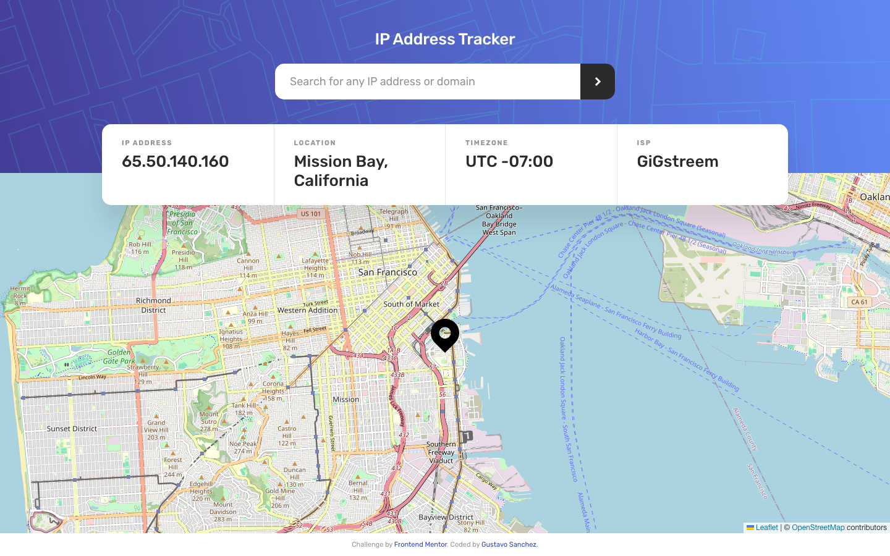
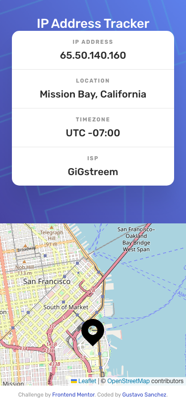

# Frontend Mentor — IP Address Tracker

A React 19 single-page application that looks up any IP address or domain and displays geolocation data alongside an interactive map. Built as a solution to the [Frontend Mentor IP Address Tracker challenge](https://www.frontendmentor.io/challenges/ip-address-tracker-I8-0yYAH0).


---

## Table of Contents

- [Overview](#overview)
- [Screenshots](#screenshots)
- [Tech Stack](#tech-stack)
- [Getting Started](#getting-started)
- [Environment Variables](#environment-variables)
- [Project Structure](#project-structure)
- [What I Learned](#what-i-learned)
- [Roadmap](#roadmap)
- [Author](#author)

---

## Overview

### The Challenge

Users should be able to:

- View the optimal layout for each page depending on their device's screen size (375px / 1440px)
- See hover states for all interactive elements
- See their own IP address on the map on initial page load
- Search for any IP address or domain and see the key information and map location

### Links

- Solution URL: [frontendmentor.io](https://www.frontendmentor.io/profile/gusanchefullstack)
- Live Site URL: [fsdev-ip-address-tracker-dev.vercel.app](https://fsdev-ip-address-tracker-dev.vercel.app)

---

## Screenshots

### Desktop (1440px)



### Mobile (375px)



---

## Tech Stack

| Layer | Technology |
|---|---|
| UI framework | [React 19](https://react.dev/) |
| Language | [TypeScript 5](https://www.typescriptlang.org/) |
| Build tool | [Vite 8](https://vite.dev/) |
| Map | [Leaflet](https://leafletjs.com/) + [react-leaflet](https://react-leaflet.js.org/) via OpenStreetMap |
| Geolocation API | [IPify Geo API v2](https://geo.ipify.org/) |
| HTTP client | [Axios](https://axios-http.com/) |
| Fonts | [Rubik — Google Fonts](https://fonts.google.com/specimen/Rubik) |

---

## Getting Started

### Prerequisites

- Node.js >= 18
- An [IPify API key](https://geo.ipify.org/) (free tier, no card required)

### Installation

```bash
# 1. Clone the repository
git clone https://github.com/gusanchefullstack/fsdev-ip-address-tracker.git
cd fsdev-ip-address-tracker

# 2. Install dependencies
npm install

# 3. Configure environment variables
cp .env.example .env
# Edit .env and add your IPify API key

# 4. Start the development server
npm run dev
```

The app will be available at `http://localhost:5173`.

### Build for Production

```bash
npm run build
npm run preview
```

---

## Environment Variables

| Variable | Description | Required | Default |
|---|---|---|---|
| `VITE_IPIFY_API_KEY` | API key from [geo.ipify.org](https://geo.ipify.org/) | Yes | — |

Create a `.env` file at the project root:

```env
VITE_IPIFY_API_KEY=your_api_key_here
```

---

## Project Structure

```
src/
├── components/
│   ├── Header/        # Page header with background pattern and title
│   ├── SearchForm/    # IP/domain search input and submit button
│   ├── InfoCard/      # Card overlay with IP geolocation summary
│   ├── InfoItem/      # Single label + value display block
│   └── MapView/       # Leaflet map with custom location marker
├── services/
│   └── ipify.ts       # IPify API client (auto-detect + manual lookup)
├── styles/
│   ├── variables.css  # Design tokens (colors, spacing, typography)
│   └── global.css     # CSS reset and base styles
├── types/
│   └── ip.ts          # TypeScript interfaces for API response
└── App.tsx            # Root component with state management
```

---

## What I Learned

### Leaflet Map Recentering with React

The key challenge was recentering the Leaflet map when new IP data loads without remounting the entire map component (which would cause a flash). The solution was a lightweight child component that calls `useMap()` inside a `useEffect`:

```tsx
function MapRecenter({ lat, lng }: { lat: number; lng: number }) {
  const map = useMap();
  useEffect(() => {
    map.setView([lat, lng], 13);
  }, [lat, lng, map]);
  return null;
}
```

This renders as `null` in the DOM but imperatively drives the map view — the React way to bridge declarative state with an imperative API.

### CSS Custom Properties for Design Tokens

Parameterising every design value (color, spacing, radius, z-index) as CSS variables made responsive overrides trivial — only the layout values change in media queries, while all colors and typography stay consistent.

### InfoCard Positioning Across Breakpoints

The info card overlaps the header bottom edge and the map top edge. On desktop this is achieved with `position: absolute; bottom: calc(-1 * var(--card-overlap))` on the header. On mobile the card is removed from absolute flow and uses a negative `margin-top` instead, since the absolute approach breaks in single-column scroll layout.

### IPify Domain vs IP Detection

The IPify API uses different query parameters for IP addresses (`ipAddress`) and domain names (`domain`). A simple regex distinguishes them:

```ts
function isDomain(query: string): boolean {
  return /^(?![\d.]+$)[a-zA-Z0-9.-]+\.[a-zA-Z]{2,}$/.test(query);
}
```

### Responsive Branch Strategy

Each responsive layout (desktop, tablet, mobile) was developed on its own feature branch (`feature/desktop`, `feature/tablet`, `feature/mobile`) and merged into main — keeping layout concerns isolated and easy to trace in git history.

---

## Roadmap

- [x] Auto-detect user IP on initial load
- [x] Search by IP address or domain name
- [x] Interactive Leaflet map with custom marker
- [x] Desktop layout (1440px)
- [x] Tablet layout (≤900px, 2-column info card)
- [x] Mobile layout (375px, stacked info card)
- [x] Accessible markup (single h1, semantic HTML, ARIA labels)
- [ ] Loading skeleton animation for info card
- [ ] IPv6 display support
- [ ] Search history (localStorage)

---

## Author

**Gustavo Sanchez**

[](https://www.linkedin.com/in/gustavosanchezgalarza/)
[](https://github.com/gusanchefullstack)
[](https://www.frontendmentor.io/profile/gusanchefullstack)
[](https://hashnode.com/@gusanchedev)
[](https://x.com/gusanchedev)
[](https://bsky.app/profile/gusanchedev.bsky.social)
[](https://www.freecodecamp.org/gusanchedev)

---

## Acknowledgments

- Challenge by [Frontend Mentor](https://www.frontendmentor.io)
- Geolocation data by [IPify](https://geo.ipify.org/)
- Map tiles by [OpenStreetMap](https://www.openstreetmap.org/copyright) contributors
